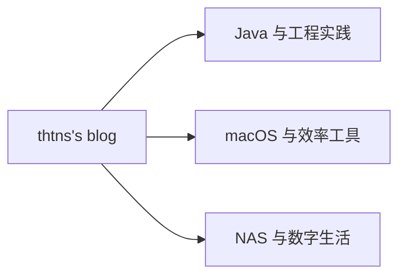

欢迎来到 **thtns's blog**。

我是 thtns，一名 Java 开发者、macOS 重度用户，也是 NAS 与家庭数字生活爱好者。创建这个博客，是希望把工作和折腾过程中真正有用的经验整理下来。

<!-- more -->

这里主要会分享三个方向的内容：

- Java 开发、工程实践与问题排查；
- macOS 软件、自动化和效率工具；
- NAS、家庭网络、数据管理与自托管服务。

比起零散的收藏，我更希望每篇文章都能讲清楚问题背景、选择过程和最终方案。也欢迎通过 [GitHub](https://github.com/thtns) 找到我。
